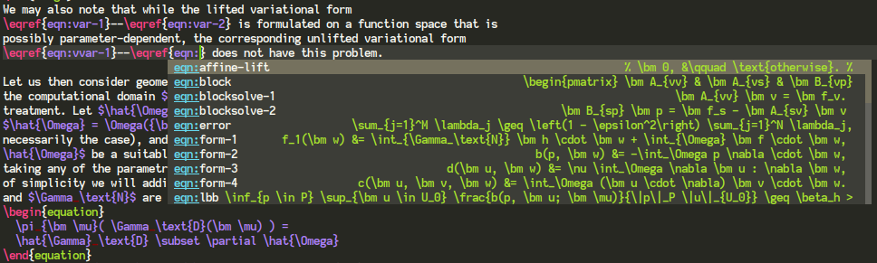
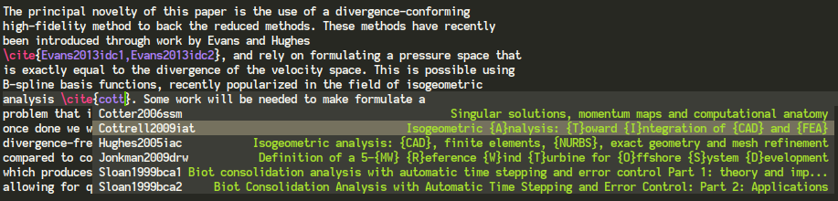

# company-reftex

This package provides two backends for [Company](http://company-mode.github.io/) for completing
label references and citations in LaTeX. It is based on RefTeX, which is included with Emacs.

To use, add the backends to `company-backends` in the buffers where you want them activated. Make
sure that `reftex-mode` is enabled also.

These backends should work well together with other LaTeX company backends, for example:

- [company-auctex](https://github.com/alexeyr/company-auctex) (note that `company-reftex` *should*
  be considerably more powerful than `company-auctex`'s backends for labels and citations, however
  `company-auctex` has other backends that may be of interest).
- [company-math](https://github.com/vspinu/company-math)

## `company-reftex-labels`

This backend completes labels, and activates in `\ref{}`, `\eqref{}` and `\autoref{}`. By default,
the completions are annotated with their contents, to help find the right one. This can be disabled
by customizing `company-reftex-annotate-labels`. The maximal annotation length can be modified with
`company-reftex-max-annotation-length`.

## `company-reftex-citations`

This backend completes citations, and activates in `cite{}`. RefTeX, and by extension this package,
will find citations in a `\begin{thebibliography}` environment, as well as citations in external
BibTeX files. By default, the completions are annotated with the title of the cited publication, to
help you find the right one. This can be disabled by customizing
`company-reftex-annotate-citations`. The maximal annotation length can be modified with
`company-reftex-max-annotation-length`.

Note that RefTeX searches for bibliography entries in names, titles, journals and all sorts of
places. This backend leverages this feature. In effect, the matching becomes very, very fuzzy
indeed.

## Tips

When working with multi-file documents, ensure that the variable `TeX-master` is appropriately set
in all files, so that RefTeX can find citations across documents.
